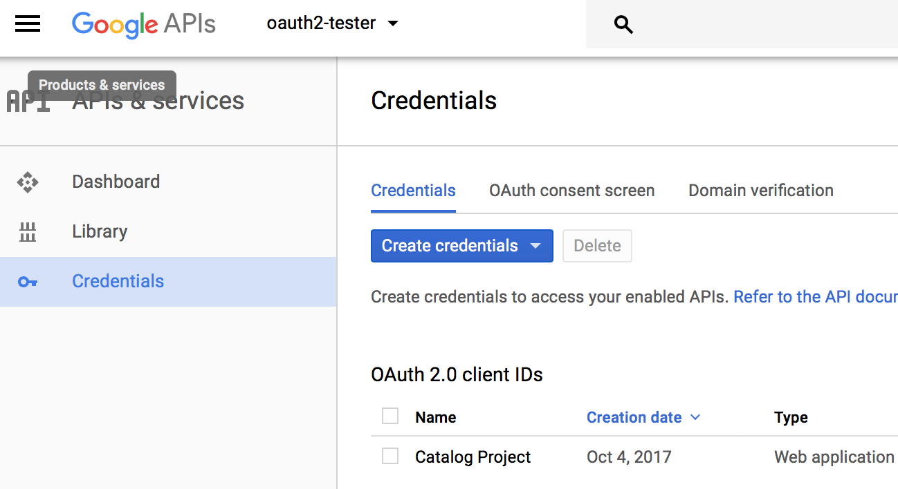
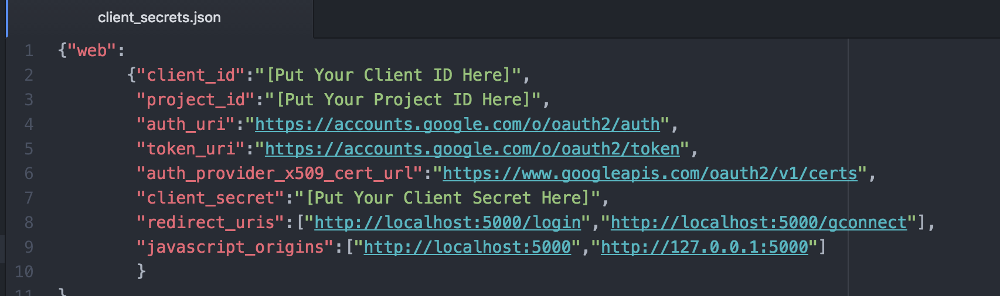

# **Golf Course Catalog**
This package gives anyone with access to the localhost port 5000 and a web browser the ability to interact with a fully-functioning ["CRUD" Website](https://en.wikipedia.org/wiki/Create,_read,_update_and_delete), implemented as a Golf Course Catalog. The website is complete with Google+ user authorization and authentication and 'personalized' user content.

## **Getting Started**
### Prior to installation
Prior to loading the package, you should have:
- Installed [Vagrant](http://vagrantup.com/) and [VirtualBox](https://www.virtualbox.org/)
- Or have SQLite3, SQLAlchemcy, Flask, and Python installed on your machine and have the ability to host on localhost port 5000.

### Installation
1. Clone this repo

2. Launch the Vagrant VM (after navigating to the directory in which you saved this repo):
```
$ vagrant up
$ vagrant ssh
```

3. Create a Google Authentication API Key

- Go to: https://console.developers.google.com
- Sign-in using your Google Account
- Create a new project
- Once you've created your new project, click on credentials on the left sidebar and 'Create Credentials' and then 'OAuth client ID'

- On the next screen, select 'Web application' and then press 'Create'
- Give the Client ID a name and authorize JavaScript origins for: http://localhost:5000
- Authorize Redirect URIs for http://localhost:5000/login
- Make note of your Project ID, Client ID, and Client secret - you'll need them in the next step

4. Update client_secrets.json with new Client ID and Client Secret


- Copy your 'client_id', 'project_id', and 'client_secret' from the last section and paste them into the JSON file.
- You can also export this file out of the google OAuth credentials creation web site with your 'client_id', 'project_id', and 'client_secret' already ready for you. To ensure proper use in this case, you must also rename the file to 'client_secrets.json', save it in the catalog directory, and add proper redirect_uris and javascript_origins as shown above.

5. To initialize SQLite3 database, run:
```
$ python model.py
```

6. To boot up web server, run:
```
$ python application.py
```

7. Access "localhost:5000/" to get started building a Golf Course Catalog!

## **Common Usage**
The webserver is usually run via a VirtualBox VM, but can be run on an machine with the ability to host on localhost port 5000.

## **Known Issues**
1. The code has a bug in which the padding on the profile-picture is not consistent on all pages.

## **License**
This code is covered under an [MIT License](./LICENSE)
